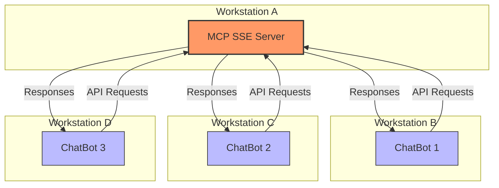

# 🧙🏻‍♂️ WASImancer
> A WebAssembly-Powered MCP SSE Server

## What is WASImancer?

WASImancer is an innovative Model Context Protocol (MCP) server built with Node.js that enhances AI tool execution through WebAssembly plugins. By leveraging the [Extism](https://extism.org/) framework, it enables seamless integration of WebAssembly modules as plugin functions, creating a flexible and powerful environment for model interactions.

## Why Use WASImancer?

### Distributed Architecture with SSE Transport

Unlike traditional MCP servers that use STDIO transport (requiring installation on the same machine as your AI application), WASImancer uses Server-Sent Events (SSE) transport, enabling a distributed architecture where:

- A single WASImancer instance can serve multiple AI applications across different machines
- Applications can access tools, resources, and prompts remotely
- You gain simplified deployment and management through centralization




### WebAssembly-Powered Tools

What makes WASImancer special is its ability to load and execute tools as WebAssembly plugin functions, providing:

- **Performance**: Near-native execution speed for your tools
- **Language Agnosticism**: Write plugins in Go, Rust, C++, or any language that compiles to WebAssembly
- **Security**: Sandboxed execution environment for your code
- **Extensibility**: Dynamically add, remove, or update plugins without server restarts

### Hot-Reloading and API-Driven Management

WASImancer enables:

- **Dynamic Plugin Management**: Upload, update, or remove WebAssembly plugins via API calls
- **Zero Downtime Updates**: Add new functionality without restarting the server
- **Easy Testing**: Quickly iterate on tool development and instantly test changes

### Configuration-Driven Setup

Set up your MCP environment using simple YAML files:

- **plugins.yml**: Define your WebAssembly tools and their functions
- **resources.yml**: Configure static contextual information
- **prompts.yml**: Create templated prompts with variable substitution

### Authentication and Admin tokens

WASImancer needs two tokens, and you can set these two tokens with environment variables:

1. A **bearer authentication token** to protect the SSE endpoints (the communications between the MCP Client and the MCP Server), use `WASIMANCER_AUTHENTICATION_TOKEN=mcp-is-the-way` (if you want to disable the authentication, set it to `NO_AUTHENTICATION`).
2. A **bearer admin token** to protect the prompts, ressources and tools management endpoints (eg: uploading a new tool, removing a resource...), use `WASIMANCER_ADMIN_TOKEN=wasimancer-rocks`

> ✋ If you don't set these tokens, the server will generate them for you at evry start (Look at the logs). You can use them to test the server, but you should set your own tokens for production.

## Getting Started

The simplest way to start using WASImancer is with Docker:

```bash
docker run --rm -p 3001:3001 \
  -e HTTP_PORT=3001 \
  -e PLUGINS_PATH=./plugins \
  -e PLUGINS_DEFINITION_FILE=plugins.yml \
  -v "$(pwd)/plugins":/app/plugins \
  -e RESOURCES_PATH=./resources \
  -e RESOURCES_DEFINITION_FILE=resources.yml \
  -v "$(pwd)/resources":/app/resources \
  -e PROMPTS_PATH=./prompts \
  -e PROMPTS_DEFINITION_FILE=prompts.yml \
  -v "$(pwd)/prompts":/app/prompts \
  -e WASIMANCER_ADMIN_TOKEN=wasimancer-rocks \
  -e WASIMANCER_AUTHENTICATION_TOKEN=mcp-is-the-way \
  -e UPLOAD_PATH=./plugins/bucket \
  k33g/wasimancer:0.0.6 
```

Or with Docker Compose:

```yaml
services:  
  wasimancer-server:
    image: k33g/wasimancer:0.0.6
    environment:
      - HTTP_PORT=3001
      - PLUGINS_PATH=./plugins
      - PLUGINS_DEFINITION_FILE=plugins.yml
      - RESOURCES_PATH=./resources
      - RESOURCES_DEFINITION_FILE=resources.yml
      - PROMPTS_PATH=./prompts
      - PROMPTS_DEFINITION_FILE=prompts.yml
      - WASIMANCER_ADMIN_TOKEN=wasimancer-rocks
      - WASIMANCER_AUTHENTICATION_TOKEN=mcp-is-the-way
      - UPLOAD_PATH=./plugins/bucket
    ports:
      - 3001:3001
    volumes:
      - ./resources:/app/resources
      - ./plugins:/app/plugins
      - ./prompts:/app/prompts
```

## Use Cases

WASImancer is ideal for:

1. **AI-Powered Applications**: Enable large language models to interact with external systems and data through tools
2. **Distributed Architectures**: Serve multiple AI applications from a central tool server
3. **Rapid Prototyping**: Quickly develop and test new AI tool capabilities
4. **Cross-Language Integration**: Bridge language barriers by compiling tools from any language to WebAssembly
5. **Secure Tool Execution**: Run untrusted code in a sandboxed environment

## Next Steps

- Explore the [examples](https://github.com/sea-monkeys/WASImancer/tree/main/examples) and [plugins](https://github.com/sea-monkeys/WASImancer/tree/main/plugins) directories for sample implementations
- Learn how to [develop your own plugins](go-plugin-guide/) in Go
- Learn how to [develop your own plugins](rust-plugin-guide/) in Rust
- Check out the [Inspector tool](https://github.com/modelcontextprotocol/inspector) to interact with your WASImancer server

Think of **WASImancer** as a bridge between the MCP ecosystem and the vast possibilities of WebAssembly, allowing developers to write plugins in their preferred language while maintaining high performance and security in a distributed architecture.
