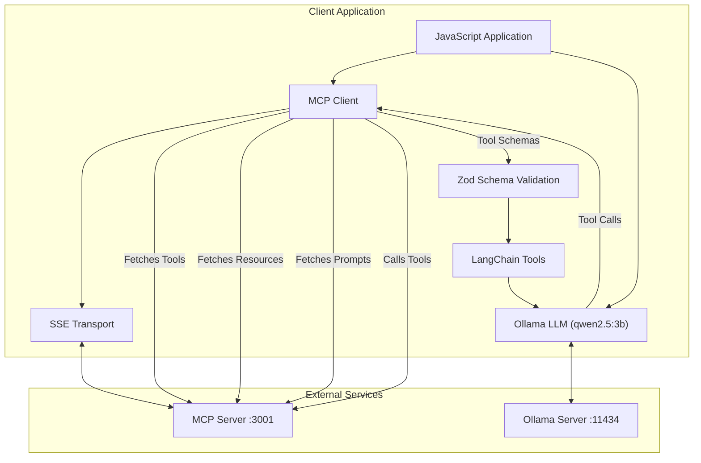
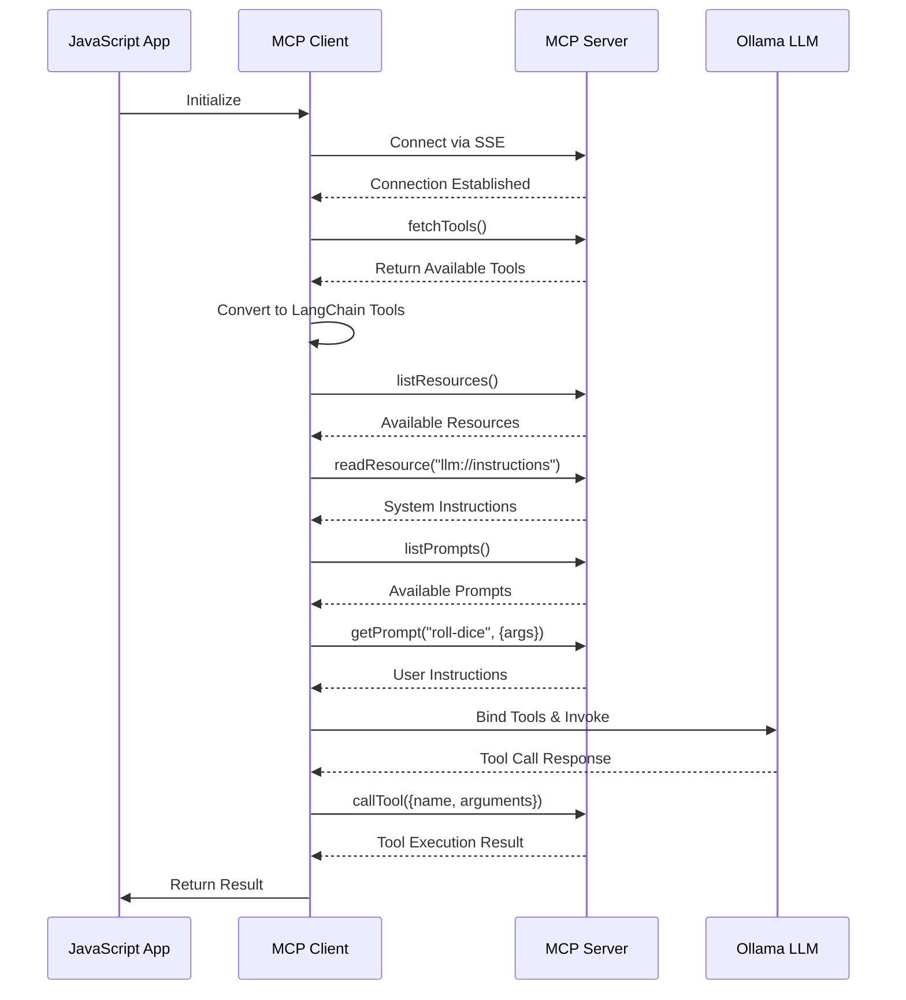
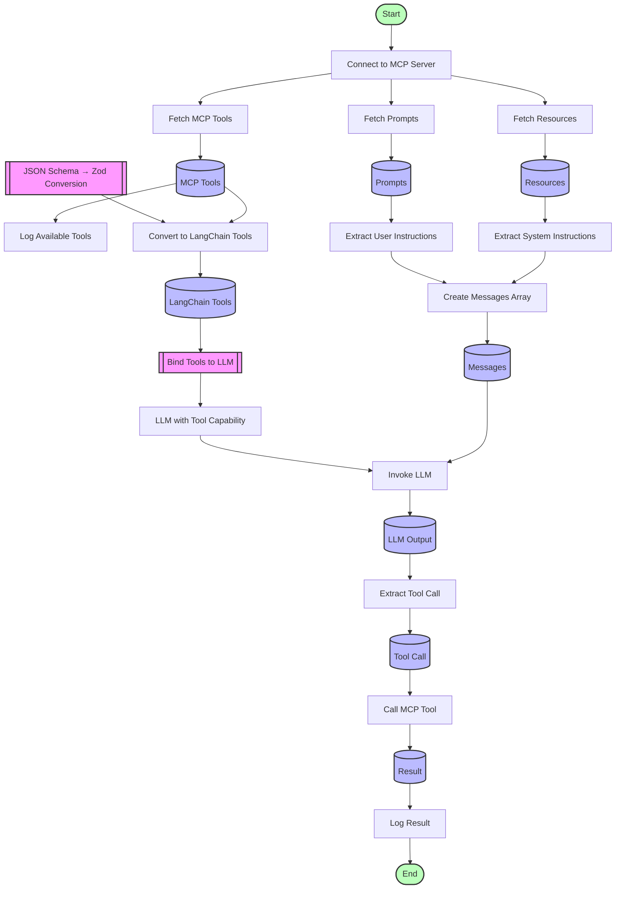

# Roll Dice example

## Purpose

This code demonstrates integration between:
- Ollama (local LLM provider)
- LangChain (framework for working with LLMs)
- Model Context Protocol (standardized communication with LLMs)

The specific example shows an LLM being used to determine which tool to call (in this case, a dice-rolling tool), demonstrating a complete agent workflow where the LLM decides what action to take based on user instructions.

## Start the MCP server

```bash
docker compose up
```
> You can test the server with `npx @modelcontextprotocol/inspector`


## Run the LangchainJS programm

```bash
node index.js
```

## Overview

This code implements a client for the Model Context Protocol (MCP). The implementation establishes a connection between a language model (LLM) from Ollama and an MCP server using Server-Sent Events (SSE) for transport.

## Key Components

### 1. Imports and Setup

```javascript
import { ChatOllama } from "@langchain/ollama";
import { z } from "zod";
import { tool } from "@langchain/core/tools";
import { Client } from "@modelcontextprotocol/sdk/client/index.js";
import { SSEClientTransport } from "@modelcontextprotocol/sdk/client/sse.js";
```

The code imports:
- `ChatOllama` from LangChain to use Ollama's language models
- `z` from Zod for schema validation
- `tool` from LangChain core for defining tools
- `Client` and `SSEClientTransport` from the Model Context Protocol SDK

### 2. Configuration

```javascript
const transport = new SSEClientTransport(new URL("http://localhost:3001/sse"));

const llm = new ChatOllama({
  model: "qwen2.5:0.5b",
  baseUrl: "http://localhost:11434",
  temperature: 0.0,
});
```

- Sets up an SSE transport at `localhost:3001/sse`
- Configures a local Ollama LLM using Qwen 2.5 (`0.5b` parameter model) with deterministic outputs (temperature `0.0` because we want to make function calling thanks the tools support of Qwen 2.5)

### 3. MCP Client Setup

```javascript
const mcpClient = new Client(
  {
    name: "mcp-sse-client",
    version: "1.0.0",
  },
  {
    capabilities: {
      prompts: {},
      resources: {},
      tools: {},
      logging: {},
    },
  }
);
```

Creates an MCP client with basic metadata and declares capabilities for working with prompts, resources, tools, and logging.

### 4. Tool Fetching

```javascript
async function fetchTools() {
  try {
    console.log("🔍 Fetching available tools...");
    const result = await mcpClient.listTools();
    return result;
  } catch (error) {
    console.error("❌ Error fetching tools:", error);
  }
}
```

A simple function to retrieve available tools from the MCP server.

### 5. Main Client Function

```javascript
async function startClient() {
  // Connect to server
  await mcpClient.connect(transport);
  
  // Fetch tools from MCP server
  let mcpTools = await fetchTools();
  
  // Convert MCP tools to LangChain tools
  let langchainTools = mcpTools.tools.map((mcpTool) => {
    return tool(null, {
      name: mcpTool.name,
      description: mcpTool.description || "No description provided",
      schema: jsonSchemaToZod(mcpTool.inputSchema),
    });
  });
  
  // Fetch resources, system instructions, and prompts
  const resources = await mcpClient.listResources();
  const llmInstruction = await mcpClient.readResource({ uri: "llm://instructions" });
  let systemInstructions = llmInstruction.contents[0].text;
  
  const prompts = await mcpClient.listPrompts();
  const prompt = await mcpClient.getPrompt({
    name: "roll-dice",
    arguments: { numDice: "3", numFaces: "12" },
  });
  let userInstructions = prompt.messages[0].content.text;
  
  // Bind tools to LLM and invoke it
  const llmWithTools = llm.bindTools(langchainTools);
  let messages = [
    ["system", systemInstructions],
    ["user", userInstructions],
  ];
  var llmOutput = await llmWithTools.invoke(messages);
  
  // Call the tool with the LLM output
  var result = await mcpClient.callTool({
    name: llmOutput.tool_calls[0].name,
    arguments: llmOutput.tool_calls[0].args,
  });
  
  console.log("✅ Server Response:", result);
}
```

This function orchestrates the entire process:
1. Connects to the MCP server
2. Fetches available tools and converts them to LangChain format
3. Retrieves system instructions and a prompt (specifically "roll-dice")
4. Binds the tools to the LLM and invokes it
5. Takes the tool call from the LLM output and executes it on the MCP server
6. Logs the server's response

### 6. Event Handlers and Utility Functions

```javascript
// Handle SSE events
transport.onmessage = (message) => {
  console.log("📩 Incoming Message:", message);
};

transport.onerror = (error) => {
  console.error("🚨 SSE Client Error:", error);
};

// Convert JSON Schema to Zod schema
function jsonSchemaToZod(jsonSchema) {
  // Implementation details...
}

// Start the client
startClient();
```

- Sets up message and error handlers for the SSE transport
- Implements a utility function to convert JSON Schema to Zod schema (for tool validation)
- Initiates the client

## Key Workflow

1. **Initialization**: Set up connections to the MCP server and Ollama LLM
2. **Discovery**: Fetch available tools, resources, and prompts from the MCP server
3. **Processing**: Convert MCP tools to LangChain format for the LLM to use
4. **Execution**: 
   - Retrieve system instructions and user prompt
   - Ask the LLM to generate a tool call 
   - Execute the tool call on the MCP server
   - Return the result


## MCP Client Architecture

This diagram shows the overall architecture of the system, including all the components and their relationships. It illustrates how the JavaScript application interacts with both the MCP Server and the Ollama LLM service, and how various components like the SSE Transport, Zod Schema Validation, and LangChain Tools fit into the architecture.



## MCP Client Sequence Flow 

This sequence diagram shows the temporal flow of operations between the main components. It details each step of the process from initialization to final result, showing how data and control pass between the JavaScript App, MCP Client, MCP Server, and Ollama LLM.



## MCP Data Flow and Transformations

This flowchart focuses specifically on the data transformations that occur throughout the process. It shows how MCP tools are converted to LangChain tools (`DynamicTool`), how system and user instructions are extracted and combined into messages, and how the LLM output is processed into a tool call.



