# WASImancer, an MCP server with SSE transport, powered by WebAssembly

> **If you need an introduction to MCP**, you can read this blog post: [Understanding the Model Context Protocol (MCP)](https://k33g.hashnode.dev/understanding-the-model-context-protocol-mcp)

## How it all started

Recently, for a future demonstration, I needed an MCP server that could be used by a ChatBot (the ChatBot would "ask" the MCP server to download source code from GitHub to be able to analyze it). I then needed several ChatBots on other machines to be able to do the same thing.

Most of the MCP server examples provided use the **STDIO** transport, but this means that the MCP server needs to be installed locally on the same machine as the ChatBot. In my case, this would mean having one MCP server instance per machine.

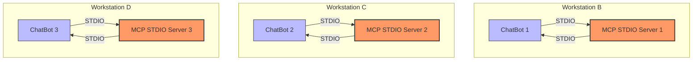

This isn't really scalable, not to mention the deployments needed for each update.

I therefore needed a "remote" MCP server. By "remote", I meant that it could be installed on machine A and then used by a ChatBot installed on machine B, but also by a ChatBot installed on machine C, and so on.
Fortunately, the MCP protocol offers a second type of transport, SSE transport, which will allow me to solve my problem and have an architecture like this:

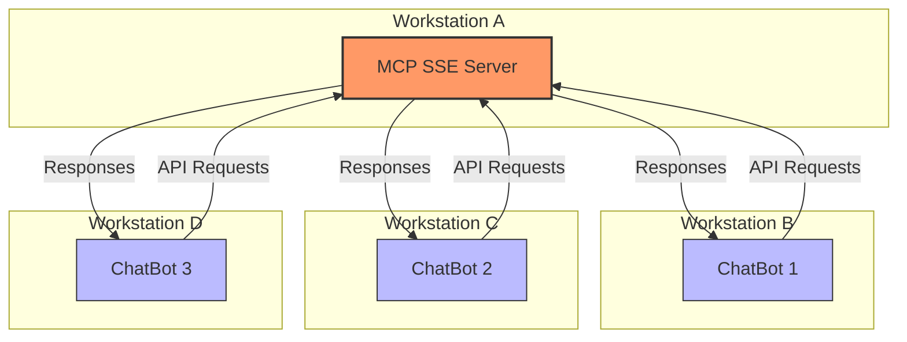

I therefore decided to create an MCP server with SSE transport that would meet my current and future needs. It needed to be as scalable as possible, and that's how the **WASImancer** project was born. The "WASI" prefix might give you a hint about what I had in mind.

## What WASImancer offers

### Implementation

I really like Node.js, so I decided to use the following SDK: [typescript-sdk](https://github.com/modelcontextprotocol/typescript-sdk), which is one of the official SDKs offered by [https://github.com/modelcontextprotocol](https://github.com/modelcontextprotocol). To code my MCP server, I stuck with JavaScript.

As I explained in the introduction, I wanted a scalable server (with the goal of being able to add functionality without modifying the core of the server). So it was obvious that I needed a plugin system. Another of my development passions is **[WebAssembly](https://webassembly.org/)** and more specifically **[WASI](https://wasi.dev/)**. And my favorite framework is **[Extism](https://extism.org/)**, which provides all the necessary tools to implement WASM plugin-based applications, including support for Node.js. So I had all the tools to get started.

> **Important**: thanks to **[Extism](https://extism.org/)**, you can develop plugins in different languages including Rust, Go, C++, Zig, and more.

#### Features

Here's what the **WASImancer** MCP server offers:

- **Tools** support: you define the **tools** configuration in a `plugins.yml` file, and each tool is a **WebAssembly** plugin offering one or more functions that can be executed on demand.
- **Resources** support: you define resources and their content in a `resources.yml` file
- **Prompts** support: you define prompts and their content in a `prompts.yml` file

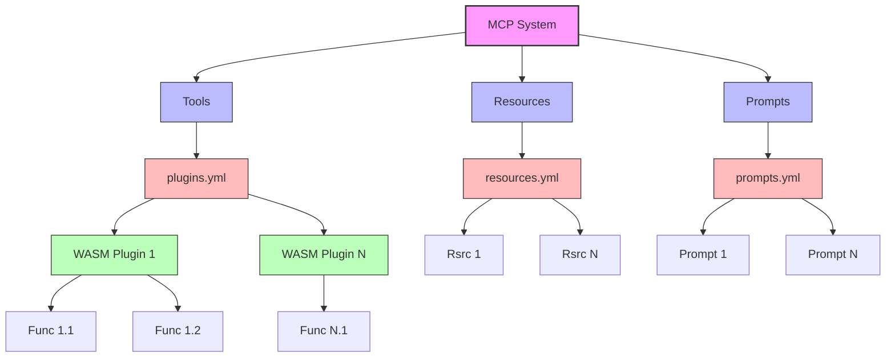

The purpose of an MCP server is to bring "super powers" to generative AI applications through **tools**, **resources**, and **prompts**.

**MCP tools** allow the MCP server to "offer" a remote client (e.g., a ChatBot) the list of tools that the MCP server can then execute at the request of the same client. For example, a `fetch` tool capable of downloading the content of a web page (a **tool** has several input parameters and one output result. Think of it as a remote function call by the client).

**MCP resources** are static or dynamic information elements that the client can request. They are often used to "store" contextual data that the LLM of the ChatBot, or any other generative AI application, can use (for example, system instructions for the ChatBot: `You are a StarTrek expert, speak like a Vulcan`). The MCP server provides the list of resources it has, and the client can request their content.
> For now, I've only implemented static resources.

**MCP prompts** are templates that define how the LLM will interact with the MCP server. They allow the client to use them in a dynamic and guided manner. A template could be `What does this function do ${function_code}`. The server will therefore offer a list of available prompts, and the client will be able to request a specific prompt with a parameter. In our example, the client will "send" the function code, and the MCP server will respond with a string built from the template and the function code.

But it's always easier to understand by putting it into practice.

## My first MCP server (with SSE transport)

### Objectives

For another project, I need to allow an LLM to roll dice. The LLM will be able to roll N dice with X faces and obtain the sum of the dice roll.

### Preparation

The structure of a **WASImancer** project is as follows (it's of course configurable):

```bash
├── roll-dice-project
    ├── compose.yml
    ├── plugins
    │   ├── plugins.yml
    │   └── roll-dice
    │       ├── go.mod
    │       ├── main.go
    │       └── wasimancer-plugin-roll-dice.wasm
    ├── prompts
    │   └── prompts.yml
    └── resources
        └── resources.yml
```

Prepare a project structure:

```bash
mkdir -p roll-dice-project/plugins/roll-dice
mkdir -p roll-dice-project/resources
mkdir -p roll-dice-project/prompts
touch roll-dice-project/compose.yml
touch roll-dice-project/plugins/plugins.yml
touch roll-dice-project/plugins/roll-dice/go.mod
touch roll-dice-project/plugins/roll-dice/main.go
touch roll-dice-project/prompts/prompts.yml
touch roll-dice-project/resources/resources.yml
```
> Using Docker Compose is not mandatory, but it's the simplest way to install and run **WASImancer**.

### Plugin development

#### Definition

Before developing the WebAssembly plugin, we'll define it in the `roll-dice-project/plugins/plugins.yml` file:

```yaml
plugins:

  - name: roll dice
    path: ./roll-dice/wasimancer-plugin-roll-dice.wasm
    version: 1.0.0
    description: roll dice
    functions:
      - displayName: rollDice
        function: rollDice
        arguments:
          - name: numFaces
            type: number
            description: number of faces on the dice
          - name: numDice
            type: number
            description: number of dice to roll
        description: a function to roll dice
```

#### Source code

I wrote the plugin in **Go** and compiled it with **[TinyGo](https://tinygo.org/)**. To make your life easier, I provide a Docker image with all the necessary dependencies (including the **Extism CLI**) to compile your Go and Rust plugins. We'll see this in the next section of this blog post.

Create the `go.mod` file with the following content:

```go
module wasimancer-plugin-dice-roll

go 1.23.0

require github.com/extism/go-pdk v1.1.1
```

Then, create the `main.go` file with the following content:

```go
package main

import (
	"encoding/json"
	"math/rand"
	"strconv"

	"github.com/extism/go-pdk"
)

type Arguments struct {
	NumFaces int `json:"numFaces"`
	NumDice  int `json:"numDice"`
}

// RollDice rolls a specified number of dice with a specified number of faces
// and returns the sum of the results

//export rollDice
func rollDice() {

	arguments := pdk.InputString()

	var args Arguments
	json.Unmarshal([]byte(arguments), &args)
	numFaces := args.NumFaces 
	numDice := args.NumDice

	// Sum of the dice roll results
	sum := 0
	
	// Roll each die and add the result to the sum
	for i := 0; i < numDice; i++ {
		// Generate a random number between 1 and numFaces
		dieValue := rand.Intn(numFaces) + 1
		sum += dieValue
	}
	
	pdk.OutputString(strconv.Itoa(sum))
	
}

func main() {
}
```

#### Build the WASM plugin

To avoid having to install a whole suite of tools, you can use this Docker image `k33g/wasm-builder:0.0.0`, which you can find the source code for here:
[wasm-builder.Dockerfile](https://github.com/sea-monkeys/WASImancer/blob/main/wasm-builder.Dockerfile).

So to compile the plugin, use the following command in the `roll-dice-project/plugins/roll-dice` directory:
```bash
docker run --rm -v "$PWD":/roll-dice -w /roll-dice k33g/wasm-builder:0.0.0 \
  bash -c "
    go mod tidy && \
    tinygo build -scheduler=none --no-debug \
      -o wasimancer-plugin-roll-dice.wasm \
      -target wasi main.go
  "
```

this will create a `wasimancer-plugin-roll-dice.wasm` file in the same directory.

#### Test the WASM plugin with the Extism CLI

If you want to test your new plugin, use the following command:
```bash
docker run --rm -v "$PWD":/roll-dice -w /roll-dice k33g/wasm-builder:0.0.0 \
  extism call wasimancer-plugin-roll-dice.wasm rollDice \
  --input '{"numFaces":6,"numDice":2}' \
  --log-level "info" \
  --wasi
```

We've just done the complicated part. Let's move on.

### Setting up resources

We'll keep it simple and offer a single resource that will be used in a future article to give instructions to the LLM.

Edit the `roll-dice-project/resources/resources.yml` file and add the following content:

```yaml
resources:
  static:
    - name: llm-instructions
      uri: llm://instructions
      contents:
        - text: You are a useful AI agent. You can help users to roll dice.
```

### Setting up prompts

Then edit the `roll-dice-project/prompts/prompts.yml` file and add the following content:

```yaml
prompts:
  predefined:
    - name: roll-dice
      arguments:
        - name: numFaces
          type: string
        - name: numDice
          type: string
      messages:
        - text: 🎲 Rolling ${numDice} dice(s) with ${numFaces} faces...
          role: user

```

So, you need to define the arguments that you will send to the MCP server, which will substitute the values in the template. For example, if `numFaces="6"` and `numDice="2"`, the MCP server will return `🎲 Rolling 2 dice(s) with 6 faces...`.

> **Note**: arguments are always of type `string`

Now we're ready to start our MCP server.

## Test my MCP server

I've created an image to distribute **WASImancer**: `k33g/wasimancer:0.0.0`, which you can find the source code for here:
[Dockerfile](https://github.com/sea-monkeys/WASImancer/blob/main/Dockerfile).

### Start the MCP server

The easiest way to install and run **WASImancer** is to use Docker Compose. Edit the `roll-dice-project/compose.yml` file with the following content:

```yaml
services:  
  wasimancer-server:
    image: k33g/wasimancer:0.0.0
    environment:
      - HTTP_PORT=3001
      - PLUGINS_PATH=./plugins
      - PLUGINS_DEFINITION_FILE=plugins.yml
      - RESOURCES_PATH=./resources
      - RESOURCES_DEFINITION_FILE=resources.yml
      - PROMPTS_PATH=./prompts
      - PROMPTS_DEFINITION_FILE=prompts.yml
    ports:
      - 3001:3001
    volumes:
      - ./resources:/app/resources
      - ./plugins:/app/plugins
      - ./prompts:/app/prompts
```

Start the server with the following command (in the `roll-dice-project` directory):

```bash
docker compose up
```

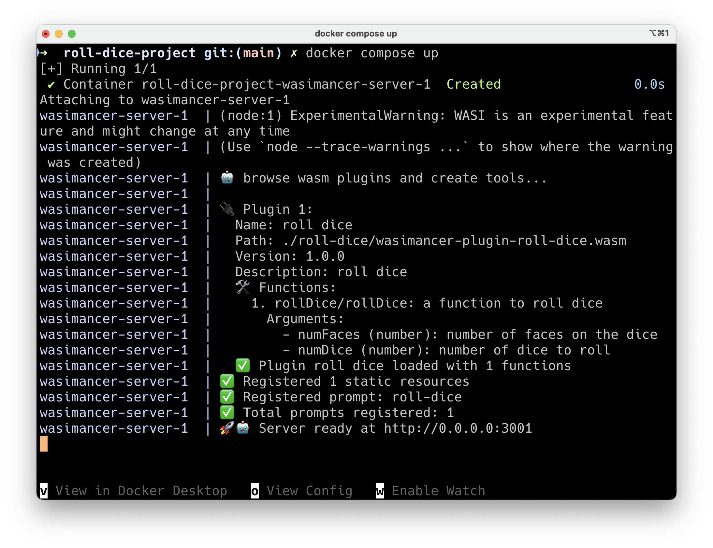

> The server listens on `http://0.0.0.0:3001`

### Test the MCP server

There's a very useful official tool for testing MCP servers: **[Inspector](https://github.com/modelcontextprotocol/inspector)**. You can install and run it with the following command:

```bash
npx @modelcontextprotocol/inspector
```

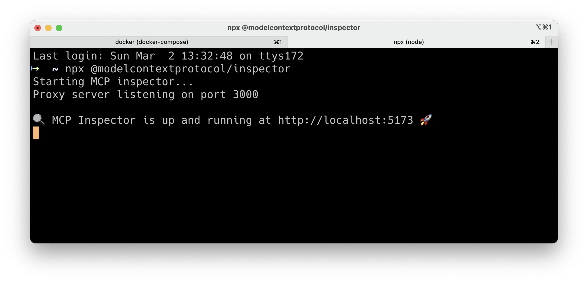

Open `http://localhost:5173` in a browser. You should arrive at this user interface:

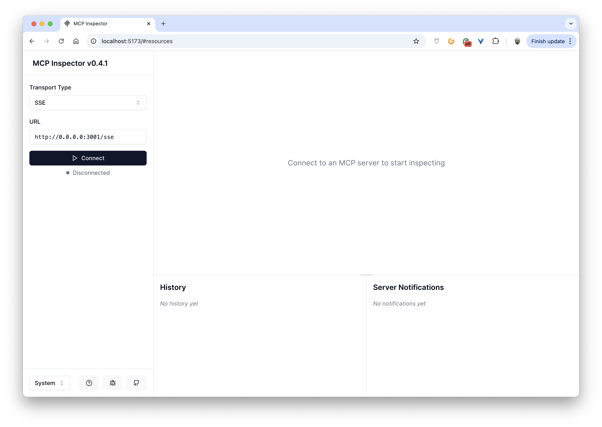

- Select `SSE` for **Transport Type**
- Enter the MCP server URL in the **URL** field, followed by `/sse`, so `http://0.0.0.0:3001/sse`
- And finally, click the **Connect** button

You'll arrive at the **Resources** tab:

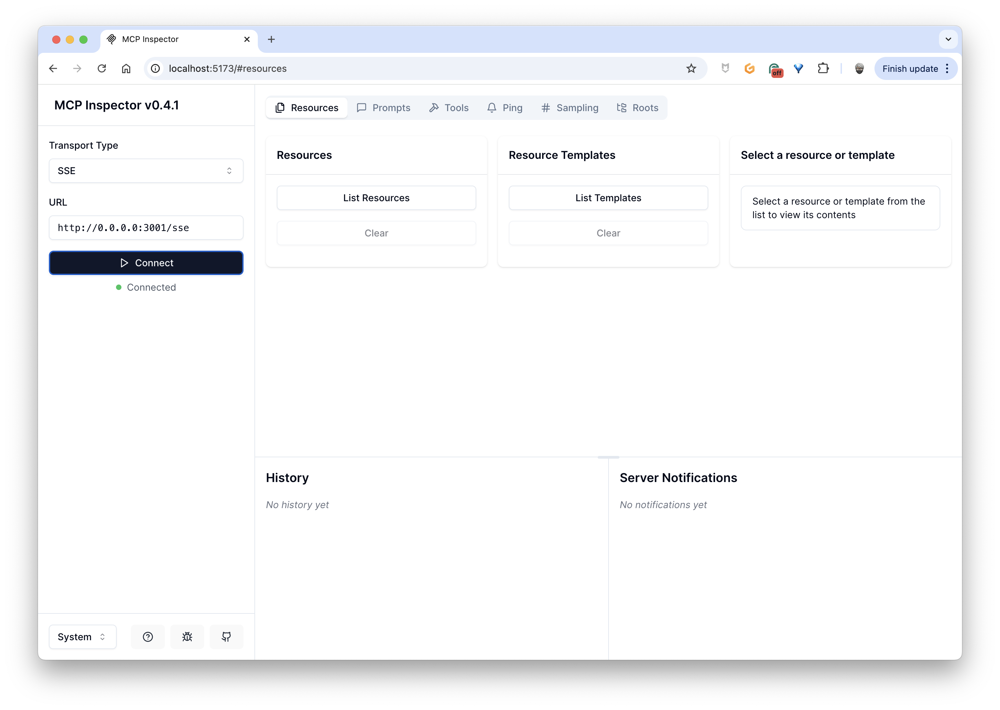

- Click on **List Resources**, you'll see the list of resources appear (in our case just one: `llm-instructions`)
- Click on the resource and in the right panel you'll see the content of the resource:

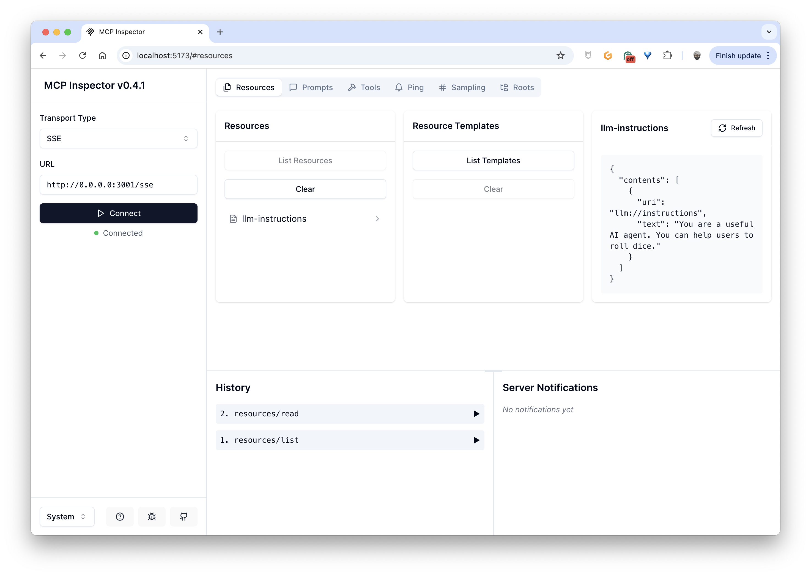

Then if you click on the **Prompt** tab, and select the `roll-dice` prompt, an input form with the parameters you defined will be displayed in the right panel:

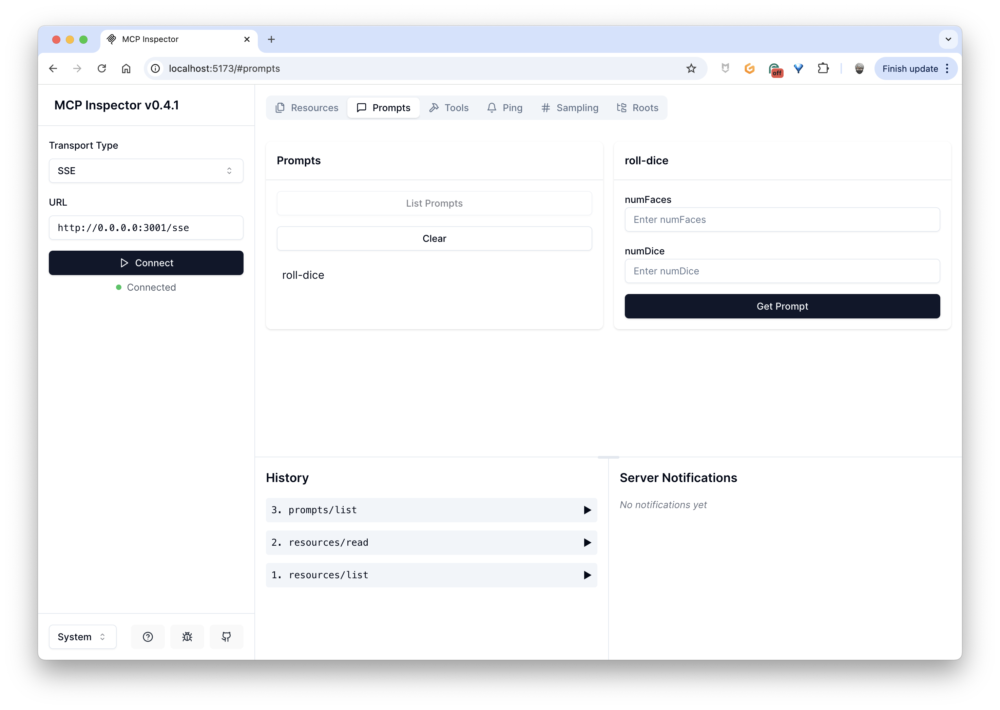

If you fill in the fields and click the **Get Prompt** button, you'll get the content of the prompt template completed with your variables:

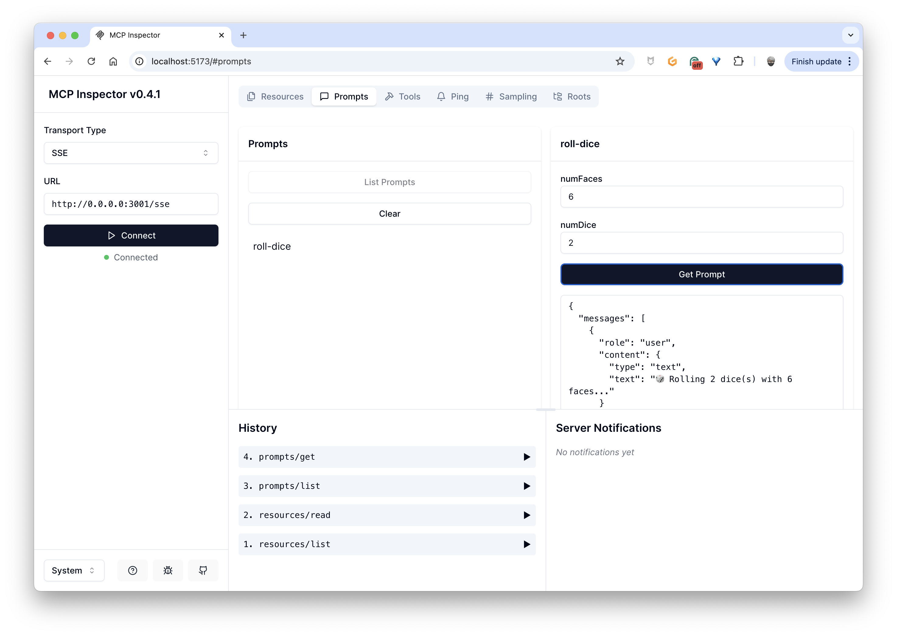

And it's exactly the same principle with **Tools**; each time you change the values of `numFaces` and `numDice` and click **Run Tool**, the WASM plugin will be executed:

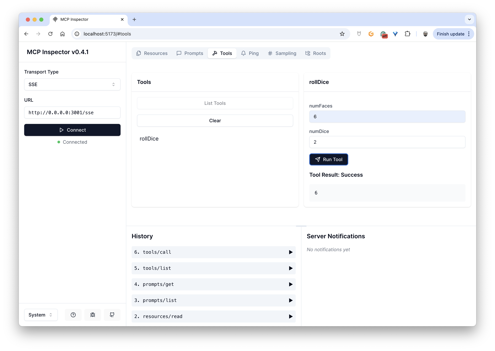

There we have it, we have a fully functional MCP Server using SSE transport. We'll use it in a future article, where I'll explain how to create a client application for this MCP server with [LangChainJS](https://js.langchain.com/) and [Ollama](https://ollama.com/).
